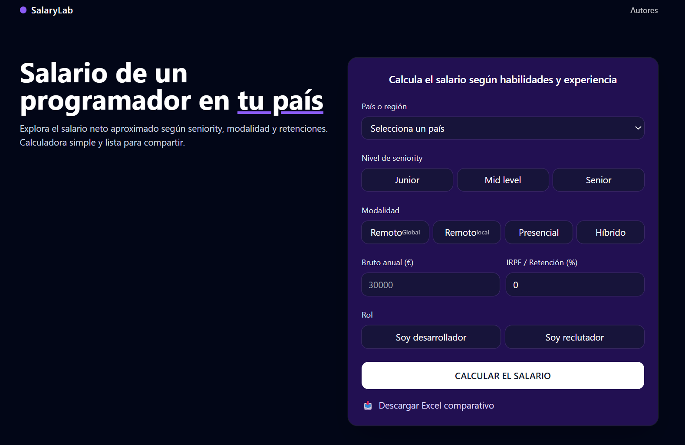

# 💻 SalaryLab — Calculadora de Salarios para Programadores

Explora el **salario neto aproximado** de un programador en distintos países, según **seniority, modalidad y retenciones**.  
Una herramienta visual, simple y lista para compartir con la comunidad.



---

## 🚀 Características

- 🌍 Selección de **país o región**.
- 🧑‍💻 Tres niveles de **seniority**: Junior, Mid level, Senior.
- 🏠 **Modalidades de trabajo**: Remoto global, remoto local, presencial e híbrido.
- 📊 Cálculo del **salario neto** aplicando IRPF o retenciones personalizadas.
- 📥 **Descarga directa** del Excel comparativo con datos actualizados.
- 👥 Sección de **autores y colaboradores** con enlaces a redes profesionales.

---

## 📂 Archivos incluidos

- `index.html` → Página web con HTML, TailwindCSS y JavaScript embebido.
- `Comparativa_Salarios_Programadores_2025.xlsx` → Archivo Excel con datos de referencia.
- `README.md` → Documentación del proyecto.

---

## 🛠 Cómo usar

1. Clona este repositorio:
   ```bash
   git clone https://github.com/usuario/salarylab.git
    ```

    
## 🌟 Inspiración

Este proyecto nació de la idea de unir datos, diseño y comunidad para que cualquier programador pueda comparar salarios en distintas partes del mundo de forma rápida y visual.

Como decía en mi publicación de LinkedIn:

> "La transparencia salarial es el primer paso hacia la equidad. Con SalaryLab, queremos empoderar a los programadores para que tomen decisiones informadas sobre su carrera y su compensación." 

## 👥 Autores & Colaboradores

- [Javier Morrón](https://www.linkedin.com/in/javiermorron) - Desarrollador/a y creador/a de contenido.
- [Ana Susana Uztariz](https://www.linkedin.com/in/susana-uzt%C3%A1riz) - Experto/a en datos.
- [ChatGPT](https://openai.com) - Diseñador/a UX/UI.

## 📝 Licencia

Este proyecto está bajo la Licencia MIT. Puedes ver el archivo [LICENSE](./LICENSE) para más detalles.
